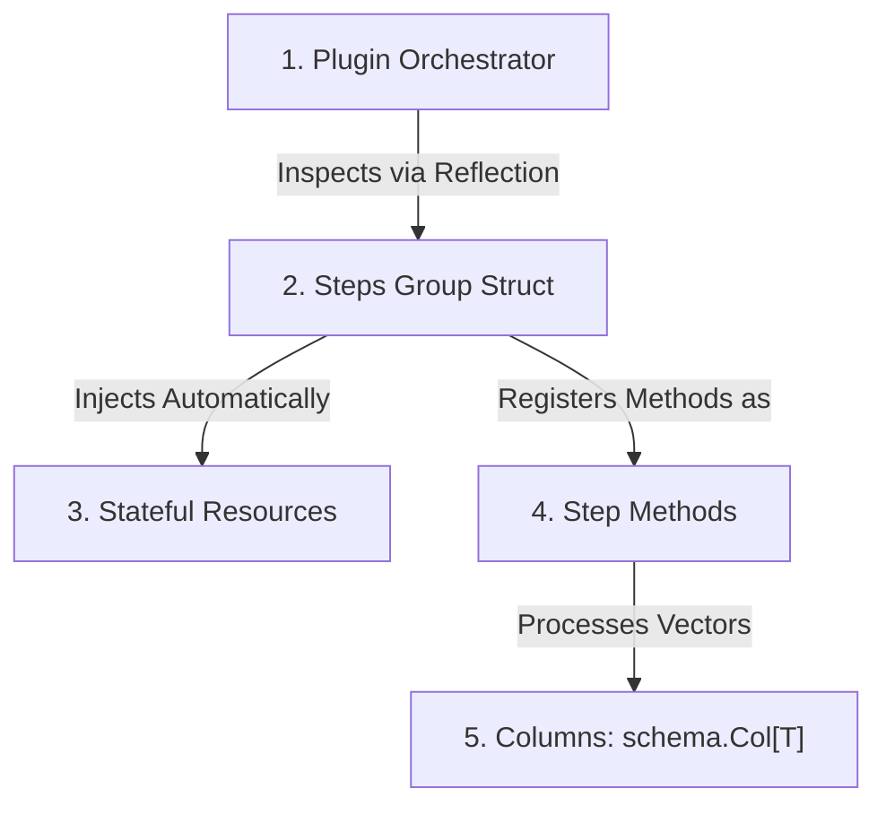

# Heddle SDK for Go

[](https://golang.org)
[](LICENSE)
[](https://godoc.org/github.com/galgotech/heddle-sdk-go)

The **Heddle SDK for Go** enables developers to build custom high-performance processing steps and complex state managers. Using a highly elegant and simple reflection-based architecture, you define your logic and dependencies in pure Go structs, letting the SDK automatically manage schemas, connection lifecycles, and parallel execution.

> [!TIP]
> **Build once, run anywhere!** Although the SDK is optimized for the **Heddle Engine** ecosystem and pipelines, it was designed to be completely decoupled. This means you can import the SDK and execute your processing steps locally within **any other Go project** (such as standard HTTP APIs or standalone microservices) without having to run Heddle workers.

---

## ⚡ Step-by-Step: Creating Your First Plugin

Let's build a real plugin that queries database scores and returns calculated metrics for a set of users.

### Step 1: Define the Stateful Resource (Database)

Any external dependency with a lifecycle (start/stop) must implement the `schema.ResourceInterface` interface:

```go
package main

import (
	"context"
	"fmt"
	"log"
)

// DatabaseConnection represents our external dependency with configurations.
type DatabaseConnection struct {
	Host string `json:"host"`
}

// Start is automatically called by the SDK resource manager to initialize the connection.
func (db *DatabaseConnection) Start(ctx context.Context) error {
	log.Printf("[DB] Connecting to host %s...", db.Host)
	return nil
}

// Close is executed when the resource reaches its idle timeout (TTL) or when the plugin shuts down.
func (db *DatabaseConnection) Close() error {
	log.Println("[DB] Gracefully closing active connections.")
	return nil
}

// Mock database query helper
func (db *DatabaseConnection) QueryScores(ctx context.Context, query string) ([]int64, error) {
	return []int64{100, 250, 420}, nil
}
```

### Step 2: Define the Data Schemas (Config, Input, and Output)

The SDK leverages Go Generics to provide strongly-typed columns (`schema.Col[T]`):

```go
import "github.com/galgotech/heddle-sdk-go/schema"

// Configuration received dynamically at execution time
type ScoreConfig struct {
	QueryString string `json:"query_string"`
}

// Columnar input structure
type ScoreInput struct {
	UserID schema.Col[string] // Column containing user IDs
}

// Columnar output structure
type ScoreOutput struct {
	CalculatedScore schema.Col[int64] // Column containing the calculated scores
}
```

### Step 3: Create the Steps Struct and Implement the Step Method

Your struct groups steps together and declares dependencies using `schema.Resource[*T]`. The processing steps are methods attached to it with a specific signature:

```go
// AnalyticsSteps groups the analytical routines of our plugin.
type AnalyticsSteps struct {
	AppVersion string
	DB         schema.Resource[*DatabaseConnection] // Managed and injected automatically by the SDK!
}

// ResolveTypes is an optional hook to resolve schemas dynamically based on runtime configurations.
func (s *AnalyticsSteps) ResolveTypes(ctx context.Context, config ScoreConfig, stepName string) error {
	return nil
}

// GetUserScores queries the database scores and returns columnar results.
// Standard required signature: func (s *Group) MethodName(ctx, config, input) (*output, error)
func (s *AnalyticsSteps) GetUserScores(ctx context.Context, cfg ScoreConfig, in *ScoreInput) (*ScoreOutput, error) {
	// 1. Obtain the active connection safely (instantiated on demand by the SDK!)
	db := s.DB.Get()

	// 2. Execute the query
	scores, err := db.QueryScores(ctx, cfg.QueryString)
	if err != nil {
		return nil, fmt.Errorf("failed to query scores: %w", err)
	}

	// 3. Construct and return the output frame structured in high-performance columns
	return &ScoreOutput{
		CalculatedScore: schema.NewCol(scores),
	}, nil
}
```

### Step 4: Register and Start the Plugin

Finally, instantiate your steps struct and register it within the plugin. Schema generation and resource wiring are 100% automated.

```go
import (
	"github.com/galgotech/heddle-sdk-go/plugin"
)

func main() {
	ctx := context.Background()

	// Create the plugin associated with the "analytics" namespace
	p := plugin.New(ctx, "analytics")

	// Instantiate the steps group
	steps := &AnalyticsSteps{
		AppVersion: "v1.0.0",
	}

	// Register the group. The SDK automatically maps resources and steps!
	if err := p.Register(steps); err != nil {
		log.Fatalf("Failed to register steps group: %v", err)
	}

	// Start IPC listener plane with the Heddle Engine (Arrow Flight and Shared Memory SHM)
	log.Println("Starting control plane listener...")
	if err := p.Start(); err != nil {
		log.Fatalf("Plugin execution failed: %v", err)
	}
}
```

---

## 🚀 Standalone Execution (Run in Any Go Project!)

One of the greatest benefits of the Heddle SDK for Go is that you **do not need the Heddle runner or workers to execute your steps**. You can run them in-process within *any* Go codebase easily using the `p.Execute` method.

This is perfect for:
- **Unit & Integration Testing**: Test step execution flow directly in Go without emulating socket connections or SHM.
- **Shared Analytics Logic**: Easily reuse complex data processing pipelines inside your own standard HTTP/gRPC APIs.

Here is how you execute the step we created earlier directly in a separate, isolated file:

```go
package main

import (
	"context"
	"fmt"
	"log"

	"github.com/galgotech/heddle-sdk-go/plugin"
	"github.com/galgotech/heddle-sdk-go/schema"
)

func main() {
	ctx := context.Background()
	
	// 1. Initialize the plugin locally
	p := plugin.New(ctx, "local_runner")

	steps := &AnalyticsSteps{}
	_ = p.Register(steps)

	// 2. Prepare configurations and inputs
	cfg := ScoreConfig{QueryString: "SELECT * FROM scores"}
	input := &ScoreInput{
		UserID: schema.NewCol([]string{"user_a", "user_b", "user_c"}),
	}

	// 4. Run directly in-memory (bypasses SHM, gRPC, and UDS entirely)
	// The step name follows the lowercase convention: "structname.methodname"
	rawOutput, err := p.Execute(ctx, "analyticssteps.getuserscores", cfg, input)
	if err != nil {
		log.Fatalf("Local execution failed: %v", err)
	}

	// 5. Consume the strongly-typed output
	output := rawOutput.(*ScoreOutput)
	fmt.Printf("Scores generated directly in-memory: %v\n", output.CalculatedScore.Data)
}
```

---

## ⚙️ High-Performance Architecture

When running inside the Heddle ecosystem, the SDK coordinates together with Heddle Workers via gRPC, Apache Arrow Flight and Shared Memory (SHM) for a highly-optimized execution.

---

## 🛠️ Prerequisites & Installation

### Prerequisites
- **Go**: Version `1.26` or higher.
- **Operating System**: POSIX-compliant OS (Linux, macOS, etc.) for Shared Memory (SHM) support.

### Installation

Add the SDK dependency to your project:

```bash
go get github.com/galgotech/heddle-sdk-go
```
---

## 🏗️ Core Components

A plugin involves 5 core components:



1. **`Plugin`** (`plugin.Plugin`): The central orchestrator. It manages component registration, network communication via gRPC/Arrow Flight, and listens for execution signals from the Heddle worker.
2. **`Steps Group Struct`**: A Go struct defined by you to group related steps (e.g., `type AnalyticsSteps struct`). The SDK uses reflection to read the methods and fields of this struct.
3. **`Stateful Resources`** (`schema.Resource[T]`): Reusable state managers (such as PostgreSQL database pools, Redis cache, or HTTP clients) declared as fields in your steps struct. The SDK instantiates them lazily on demand, passes configurations, and disposes of them if they become inactive (with an adjustable idle TTL).
4. **`Step Methods`**: Methods attached to your steps struct that contain the actual processing logic. They receive configurations and input columns, and return output columns and errors.
5. **`Columns`** (`schema.Col[T]`): Reusable, high-performance generic vectors wrapping data columns natively with zero-copy.

---


## 📜 License & Support

This project is licensed under the **GNU General Public License Version 3** (see the [LICENSE](LICENSE) file for the full text). If you encounter any bugs or have feature requests, please open an issue in the official repository issue tracker.
